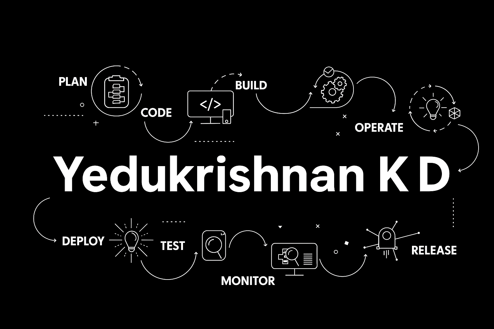

  

  
<!---  
-->

Hi there, I'm Yedu Krishnan KD

                    🚀 DevOps Engineer | Cloud | Automation | CI/CD | Kubernetes |  IT Support 

 

---

## 🛠️ Tech Stack  

### 🚀 DevOps & Cloud

 

### ⚙️ CI/CD & Automation

 

### 📦 Databases

### 💻 Languages & Scripting

### 🔧 Tools

---

## 📊 GitHub Stats  

  
 

---
